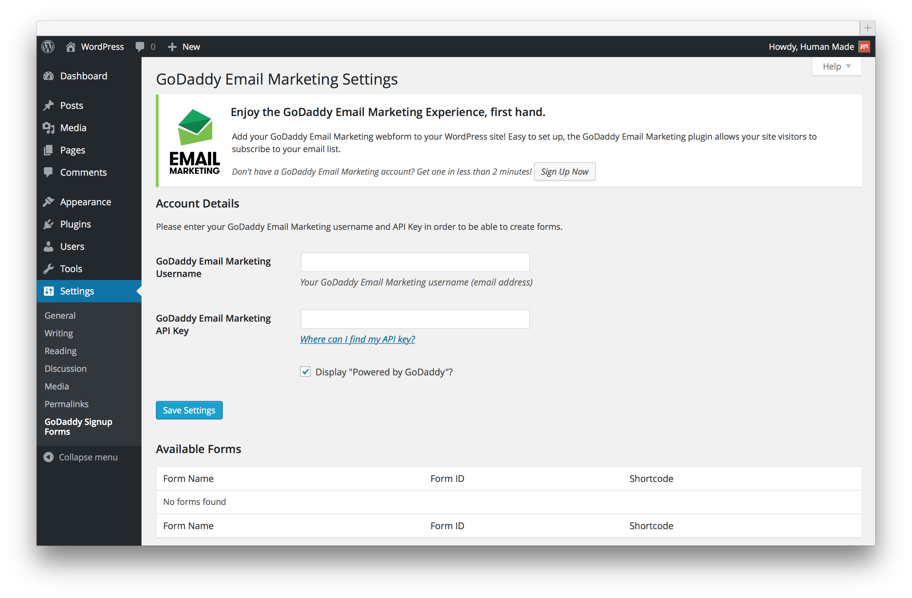
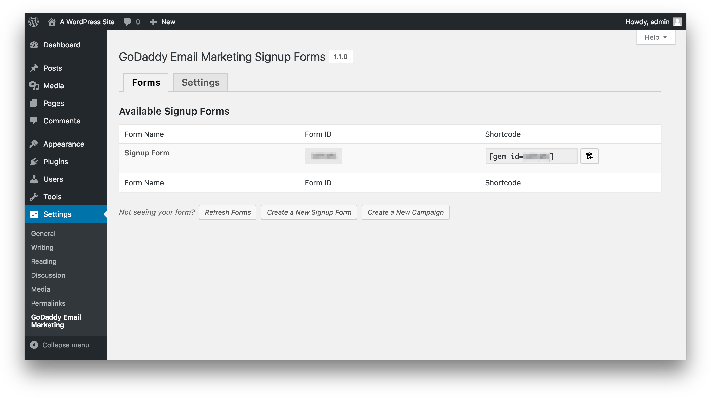
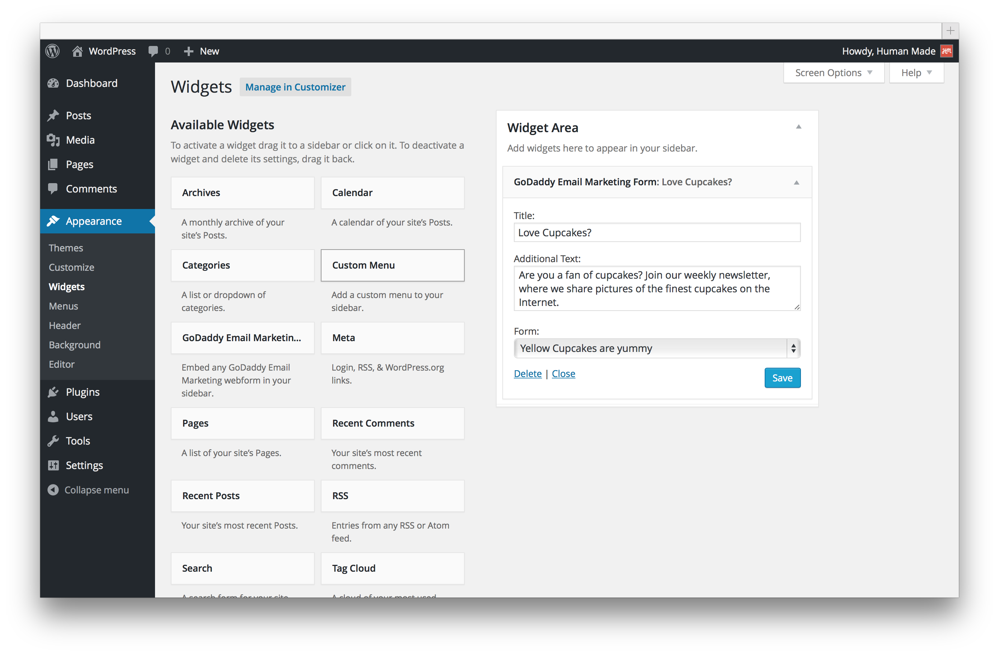
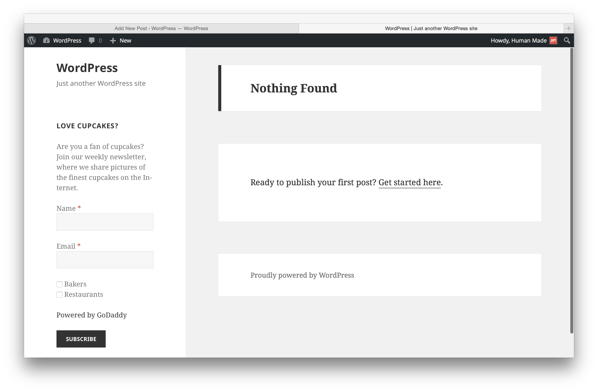

<!-- DO NOT EDIT THIS FILE; it is auto-generated from readme.txt -->
# GoDaddy Email Marketing

Add the GoDaddy Email Marketing plugin to your WordPress site! Easy to set up, the plugin allows your site visitors to subscribe to your email lists.

**Contributors:** [godaddy](https://profiles.wordpress.org/godaddy), [humanmade](https://profiles.wordpress.org/humanmade), [xwp](https://profiles.wordpress.org/xwp), [fjarrett](https://profiles.wordpress.org/fjarrett), [jonathanbardo](https://profiles.wordpress.org/jonathanbardo)  
**Tags:** [godaddy](https://wordpress.org/plugins/tags/godaddy), [forms](https://wordpress.org/plugins/tags/forms), [newsletter](https://wordpress.org/plugins/tags/newsletter), [opt-in](https://wordpress.org/plugins/tags/opt-in), [email](https://wordpress.org/plugins/tags/email), [marketing](https://wordpress.org/plugins/tags/marketing), [mailing list](https://wordpress.org/plugins/tags/mailing list), [signup](https://wordpress.org/plugins/tags/signup), [subscribe](https://wordpress.org/plugins/tags/subscribe), [widget](https://wordpress.org/plugins/tags/widget)  
**Requires at least:** 3.8  
**Tested up to:** 4.5  
**Stable tag:** 1.0.4  
**License:** [GPLv2 or later](http://www.gnu.org/licenses/gpl-2.0.html)  

   

## Description ##

The GoDaddy Email Marketing signup form plugin makes it easy to grow your subscribers! Use this plugin to integrate your signup forms into your WordPress site. To learn more, [pick up a GoDaddy Email Marketing account](https://www.godaddy.com/business/email-marketing) and explore.

Once the plugin is activated, you can select and insert any of your GoDaddy Email Marketing signup forms right into your site by using a widget, shortcode, or template tag.

Setup is easy; in the plugin Settings, simply enter your account email address and API key (found in the Settings section of your GoDaddy Email Marketing account), and you're all set.

**Official GoDaddy Email Marketing Signup Forms plugin features:**

* Automatically add new forms for users to sign up to an email list of your choice.
* Insert unlimited signup forms using the widget, shortcode, or template tag.
* Use quick links to edit and preview your form in GoDaddy Email Marketing.

**Languages Supported:**

* English
* Deutsch
* Español
* Español de México
* Français
* Português do Brasil
* Português

**Find a bug?**

Please fill out an issue [here](https://github.com/godaddy/wp-godaddy-email-marketing/issues).

## Installation ##

* Upload plugin files to your plugins folder, or install using WordPress' built-in Add New Plugin installer.
* Activate the plugin.
* Go to the plugin Settings page (under Settings > GoDaddy Email Marketing Settings).
* Enter your account email address and API key (found in the Settings section of your GoDaddy Email Marketing account).
* Click **Save Changes**.

After your account is verified, you can insert a form into your site by using a widget, shortcode, or template tag:

* **Widget** Go to Appearance > Widgets, find the GoDaddy Email Marketing widget, and drag it into the widget area of your choice. You can then add a title and select a form!
* **Shortcode** Add a form to any post or page by adding the shortcode (e.g., `[gem id=80326 ]`) in the page/post editor. You can find a form's ID on the GoDaddy Email Marketing Settings page.
* **Template** tag Add the following template tag into any WordPress file: `<?php gem_form; ?>`. For example: `<?php gem_form( 91 ); ?>` You can find a form's ID on the GoDaddy Email Marketing Settings page.

That's it. You're ready to go!

## Frequently Asked Questions ##

### What is GoDaddy Email Marketing? ###
GoDaddy Email Marketing is the easiest way to create, send, share, and track email newsletters online. It's for people who want email marketing to be simple.

### Do I need a GoDaddy Email Marketing account to use this plugin? ###
Yes, this plugin requires a [GoDaddy Email Marketing](https://www.godaddy.com/business/email-marketing) account.

### Is there a widget? ###
Absolutely. Use it by finding the GoDaddy Email Marketing widget under Appearance >Widgets in the WordPress Dashboard and dragging it into the widget area of your choice. You can then add a title and select a form!

### Is there a shortcode? ###
Yes! You can add a form to any post or page by adding the shortcode with the form ID (e.g., `[gem id=80326 ]`) in the page/post editor. Form IDs are listed on the GoDaddy Signup Forms Settings page.

### Is there a template tag? ###
Yup! Add the following template tag into any WordPress file: `<?php gem_form( $form_id ); ?>`. For example: `<?php gem_form( 91 ); ?>`. Form IDs are listed on the GoDaddy Signup Forms Settings page.

### Where can I find the API Key? ###
You can find your API key in the Settings section of your GoDaddy Email Marketing account.

## Screenshots ##

### Settings screen.

### A full list of your GoDaddy Email Marketing Webforms, with ready shortcodes.

### The widget, on the widgets page.

### The widget, on the front-end.

## Changelog ##

### 1.0.4 ###
* Localization
* Code style improvements
* Unit tests

### 1.0.3 ###
* Added support for web form fancy fields
* Made some styling changes to mobile view

### 1.0.2 ###
* Fixed incorrectly loaded stylesheet
* Minor style improvements to front-end form output

### 1.0.1 ###
* Move the "Powered by GoDaddy Link" below the submit button and link it up to the correct place

### 1.0 ###
* Initial version. forked from the Mad Mimi Sign Up Forms WordPress Plugin: https://wordpress.org/plugins/mad-mimi-sign-up-forms/

